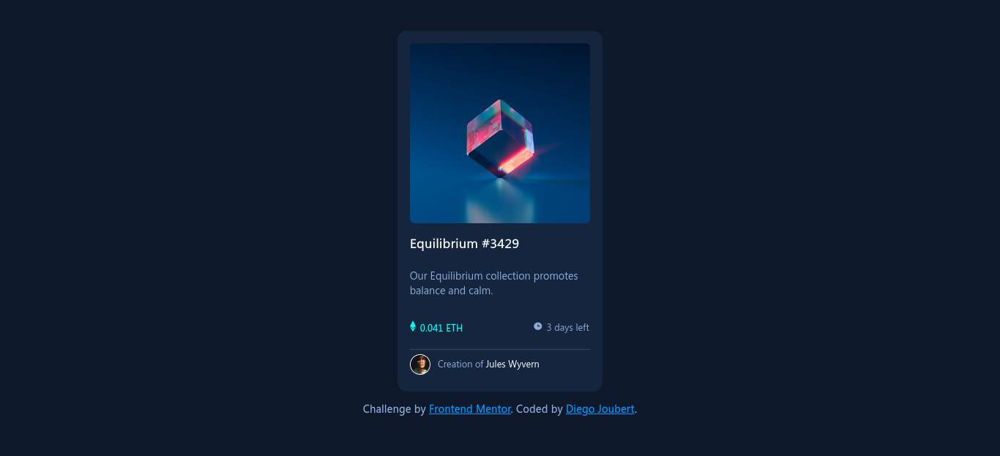

 # Frontend Mentor - NFT Preview Card Component 

This is my solution to the [NFT Preview Card Component challenge on Frontend Mentor](https://www.frontendmentor.io/challenges/nft-preview-card-component-SbdUL_w0U).

## Table of contents

- [Overview](#overview)
  - [Screenshot](#screenshot)
  - [Links](#links)
- [My process](#my-process)
  - [Built with](#built-with)
  - [Continued development](#continued-development)
- [Author](#author)

## Overview

### Screenshot

### Links

- Solution URL: [https://github.com/diego-joubert/nft-preview-card-component](https://github.com/diego-joubert/nft-preview-card-component)
- Live Site URL: [https://diego-joubert.github.io/nft-preview-card-component](https://diego-joubert.github.io/nft-preview-card-component)

## My process

### Built with

- Semantic HTML5 markup
- CSS
- CSS variables

### Continued Development

I want to keep focusing on CSS Flexbx/Grid and responsiveness in order to build more professional layouts. Also, I have started learning about multi-column layout and CSS Animations.

## Author

- Github - [diego-joubert](github.com/diego-joubert)
- Frontend Mentor - [@diego-joubert](https://www.frontendmentor.io/profile/diego-joubert)
